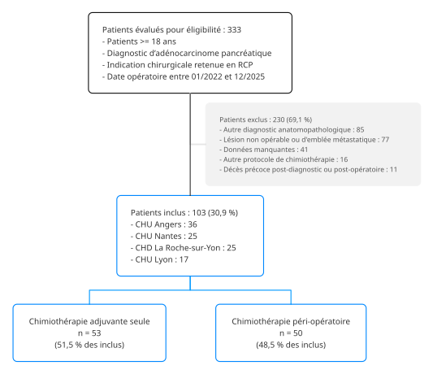

```{r}
#| label: setup
#| include: false

options(easy_out.quiet = TRUE)
source("setup.R")
auto_exec()
```

```{=html}
<style>
p {
  text-align: justify
}
</style>
```

# Matériel et méthodes

## Design et aspects réglementaires

Il s'agissait d'une étude observationnelle, rétrospective, multicentrique, conduite dans quatre centres hospitaliers français : CHU Nantes, CHD La Roche-sur-Yon, CHU Angers et CHU Lyon.

Les données ont été recueillies rétrospectivement à partir du dossier patient informatisé.
L'étude a été menée conformément à la méthodologie de référence MR004 de la Commission nationale de l'informatique et des libertés (CNIL), qui encadre les recherches n'impliquant pas la personne humaine et les réutilisations de données de santé déjà recueillies.
L'absence d'opposition de chaque patient au traitement de ses données a été vérifiée.
S'agissant d'une recherche n'impliquant pas la personne humaine, l'avis d'un comité de protection des personnes n'était pas requis.

## Objectifs de l'étude

L'objectif principal était de comparer le nombre total de cures de chimiothérapie reçues entre les deux protocoles (chimiothérapie adjuvante seule et chimiothérapie péri-opératoire), et d'identifier les autres facteurs associés.

Les objectifs secondaires étaient les suivants :

- Comparer la survie globale et la survie sans récidive entre les deux protocoles de chimiothérapie
- Décrire les caractéristiques des patients à l'inclusion, les caractéristiques tumorales et la prise en charge chirurgicale
- Décrire les doses reçues, leurs adaptations et la toxicité chimio-induite de grade III-IV sur l'ensemble du traitement

## Critères de jugement

### Critère de jugement principal

Le critère de jugement principal était le nombre total de cures de chimiothérapie reçues, toutes phases confondues (phase d'induction et phase adjuvante).
Il s'agit du nombre de cures effectivement reçues et non d'un nombre de cures planifié.
Un patient n'ayant reçu aucune cure d'une phase a été compté à zéro pour cette phase, et non en donnée manquante.

Le protocole de chimiothérapie désignait la stratégie choisie pour le patient et non le traitement effectivement reçu : un patient orienté vers une chimiothérapie adjuvante seule n'ayant finalement reçu aucune cure a donc été analysé dans ce groupe (intention de traiter).

Ce nombre de cures de chimiothérapie a été analysé sous forme de comptage brut.
Le comptage du nombre de cures reçues a été décrit par phase et toutes phases confondues.
La proportion de patients ayant reçu au moins 12 cures a été décrite à titre complémentaire, ainsi que celle des patients les ayant reçues sans réduction de dose de plus de 20 % à la dernière cure de chaque phase, sur aucune des trois molécules.

### Critères de jugement secondaires

Les critères de jugement secondaires étaient la survie globale et la survie sans récidive.
La survie globale était définie comme le délai entre la date de la chirurgie et le décès toutes causes.
La survie sans récidive était définie comme le délai entre la date de la chirurgie et le premier évènement survenu parmi la récidive ou le décès toutes causes.

Un patient orienté vers un protocole de chimiothérapie péri-opératoire devait nécessairement survivre à la phase d'induction et être opéré : considérer la survie globale depuis le diagnostic aurait attribué à ce groupe un temps de survie garanti par construction, d'autant plus long que le délai entre le diagnostic et la chirurgie est long.
La chirurgie comme point de départ pour la survie globale a été choisie pour contrôler ce biais de temps immortel favorable au protocole de chimiothérapie péri-opératoire.
Une analyse de sensibilité conservant l'échelle de temps depuis le diagnostic a été conduite.

Le premier évènement observé pour chaque patient a été classé en récidive, décès sans récidive, ou censure.
Les patients sans évènement ont été censurés à la date du recueil dans leur centre (date de point), la date de dernières nouvelles individuelle n'ayant pas été recueillie.
La censure était donc exclusivement administrative.

## Population d'étude

Étaient éligibles les patients (H/F) âgés de 18 ans ou plus porteurs d'un diagnostic d'adénocarcinome pancréatique, pour lesquels une indication chirurgicale avait été retenue en RCP, et dont la date opératoire était programmée entre le 1er janvier 2022 et le 31 décembre 2025 inclus, dans l'un des quatre centres sus-cités.

Les critères d'exclusion étaient les suivants :

- Autre diagnostic anatomopathologique
- Lésion non opérable ou d'emblée métastatique
- Autre protocole de chimiothérapie
- Décès précoce post-diagnostic ou post-opératoire
- Données insuffisantes

## Plan d'analyse statistique

Les tests statistiques étaient bilatéraux.
Le degré de significativité était défini par une p-valeur strictement inférieure au seuil de 5 %.
Les p-valeurs étaient rapportées avec deux chiffres significatifs.
Pour chaque variable, le degré de significativité rapporté était global.
Il a été obtenu par un test du rapport de vraisemblance pour les modèles de comptage et pour les modèles de Cox univariables, et par un test de Wald dans les modèles de Cox multivariables en cas de stratification.
L'âge a été introduit dans les modèles après discrétisation en tranches de 5 ans : l'estimation rapportée correspondait à l'effet d'une tranche de 5 ans supplémentaire.

### Analyses descriptives

Les variables catégorielles ont été présentées sous forme d'effectif et de pourcentage.
Les variables continues ont été présentées sous forme de médiane avec leur intervalle interquartile.

Les caractéristiques décrites étaient celles des patients à l'inclusion, les caractéristiques tumorales et la prise en charge chirurgicale, le type de récidive, les doses de chimiothérapie reçues avec leurs adaptations, ainsi que la toxicité chimio-induite de grade III-IV.
Elles ont été décrites globalement et selon le protocole de chimiothérapie.

Les deux protocoles ont été comparés par un test du khi-deux d'indépendance sans correction de continuité pour les variables catégorielles, remplacé par un test exact de Fisher dès qu'un effectif théorique était inférieur à 5, et par un test de Wilcoxon-Mann-Whitney pour les variables continues.
Ces comparaisons étaient descriptives.

La résécabilité de la tumeur au diagnostic a été classée selon les critères du *National Comprehensive Cancer Network* (NCCN), en tumeur résécable d'emblée, borderline ou localement avancée.
Les complications post-opératoires ont été cotées selon la classification de Clavien-Dindo, une complication majeure étant définie par un grade supérieur ou égal à III.
Les doses reçues, leurs adaptations et la toxicité chimio-induite ont été décrites sur l'ensemble du traitement, chez les patients ayant reçu au moins une cure, sans distinguer la phase d'induction de la phase adjuvante.
La phase d'induction ne concernait que le groupe péri-opératoire.
La dose et le pourcentage d'adaptation retenus étaient ceux de la dernière cure.
La toxicité chimio-induite rapportée était la toxicité de grade III-IV cotée selon la *Common Terminology Criteria for Adverse Events* (CTCAE) v5.0.

### Analyse du critère de jugement principal

Le nombre total de cures de chimiothérapie reçues a été analysé sous sa forme brute de comptage, sans dichotomisation.
Ce comptage a d'abord été modélisé par une régression de Poisson, dont l'hypothèse d'équidispersion a été vérifiée par un test de dispersion de Pearson.
Il était convenu de retenir la famille quasi-Poisson pour l'ensemble des estimations rapportées dès lors que le facteur de dispersion estimé était supérieur à 1, sans conditionner ce choix à la significativité du test.
Ce correctif laisse les estimations ponctuelles inchangées et n'agit que sur leur précision, corrigée du facteur de dispersion (modèle conservateur).

Chaque variable a été analysée séparément dans un modèle univariable, puis les variables retenues a priori ont été incluses dans un modèle ajusté (analyse multivariable).
Les coefficients ont été présentés après passage à l'exponentielle, sous forme de rapports du nombre moyen de cures, accompagnés de leur intervalle de confiance à 95 %.

L'absence de colinéarité entre les variables du modèle ajusté a été vérifiée par le facteur d'inflation de la variance (VIF).
La présence d'observations influentes a été recherchée par les distances de Cook, au seuil de `r .pois_check_cook$threshold`.

### Analyses de survie

La survie globale et la survie sans récidive ont fait l'objet du même plan d'analyse.

#### Suivi des patients

Le suivi médian a été estimé sur l'échelle de temps de la survie globale, depuis la date de la chirurgie, par la méthode de Kaplan-Meier inversée (méthode de Schemper, l'évènement étant la fin du suivi et la censure étant le décès).
La courbe de suivi a été représentée graphiquement selon le protocole de chimiothérapie.
Le recul des patients vivants à la date de point a été décrit, ainsi que les dates de point propres à chaque centre.

#### Évènements

La distribution du premier évènement observé, classé en récidive, décès sans récidive ou censure, a été décrite globalement et selon le protocole de chimiothérapie.

#### Courbes de survie

Les courbes de survie ont été estimées par la méthode de Kaplan-Meier, d'abord dans la population totale puis selon le protocole de chimiothérapie.
Les probabilités de survie ont été rapportées à plusieurs intervalles de temps, avec leur intervalle de confiance à 95 %.
Les médianes de survie ont été rapportées avec leur intervalle de confiance à 95 %, ou déclarées non atteintes le cas échéant.
Les effectifs à risque ont été rapportés sous chaque courbe, ainsi que les évènements et les censures rapportés en effectifs cumulés au cours du temps.
Les distributions de survie ont été comparées par un test du log-rank, non ajusté.

#### Modèles de Cox

L'effet du protocole de chimiothérapie sur la survie globale et sans récidive a été estimé par un modèle de Cox univariable.

L'effet de chaque facteur associé a été estimé par des modèles de Cox univariables, puis par un modèle multivariable.
Les variables incluses dans l'analyse multivariable ont été définies a priori sur des considérations cliniques, puis cette liste a été révisée à la lecture des effectifs réellement observés.
La même spécification a été retenue pour l'estimation de la survie globale et de la survie sans récidive.
Aucune sélection de variables fondée sur la significativité statistique en analyse univariable n'a été réalisée.
Le centre a été traité comme variable de stratification et non comme covariable : le modèle admet un risque de base propre à chaque centre sans en estimer le coefficient.

Les hazard ratios et leurs intervalles de confiance à 95 % représentent, pour chacune des variables, le sur-risque ou le sous-risque d'évènement par rapport à la modalité de référence.
Le nombre d'évènements et le nombre d'observations complètes de chaque modèle multivariable ont été rapportés, ainsi que le nombre d'observations écartées pour données manquantes.
L'hypothèse de proportionnalité des risques a été vérifiée pour chaque variable ainsi que globalement, par le test basé sur les résidus de Schoenfeld.

La survie globale a fait l'objet d'une analyse de sensibilité sur l'échelle de temps depuis le diagnostic, les patients entrant dans l'ensemble à risque à la date de leur chirurgie et non à l'origine (troncature à gauche).
Cette spécification retire du dénominateur le temps séparant le diagnostic de la chirurgie, pendant lequel un patient de la cohorte ne pouvait pas décéder, tout en conservant l'échelle de temps depuis le diagnostic.
Les modèles univariable et multivariable y ont repris la spécification retenue pour l'analyse principale.

### Données manquantes

Le nombre de données manquantes a été précisé pour chaque variable décrite et pour chaque sous-groupe.
Aucune imputation n'a été réalisée pour cette étude.
Les modèles multivariables ont été estimés sur les observations complètes pour l'ensemble des variables incluses.
Le nombre d'observations écartées pour données manquantes a été rapporté sous chaque table d'estimation.

### Taille d'échantillon

Aucun calcul du nombre de sujets nécessaires n'a été réalisé pour cette étude.
L'effectif analysé était déterminé par le nombre de dossiers disponibles dans les quatre centres au moment du recueil, sur la période étudiée.
La puissance statistique n'a pas été planifiée.

### Environnement logiciel

Les analyses statistiques ont été réalisées avec le langage `r R.version.string`.
Les estimations de survie et les modèles de Cox ont été obtenus avec `survival` (version `r packageVersion("survival")`).
Les modèles de comptage ont été obtenus avec `stats::glm` (familles Poisson et quasi-Poisson), et leurs diagnostics avec `performance` (version `r packageVersion("performance")`).
Les p-valeurs globales par variable ont été obtenues avec `car` (version `r packageVersion("car")`).
L'inventaire détaillé de l'environnement et des packages utilisés est disponible en @sec-session.

# Résultats

## Flowchart

Dans un premier temps, l'analyse de `r n$screening` dossiers a permis de retenir `r n$eligible` patients sur les critères d'éligibilité.
Parmi ces patients, `r n$exclus` (`r n$pct_exclus`) ont été exclus.
Au total, ont été inclus `r n$inclus` (`r n$pct_inclus`) patients adultes atteints d'un adénocarcinome pancréatique opéré entre le 1er janvier 2022 et le 31 décembre 2025 inclus, au CHU de Nantes ou dans un autre centre (4 centres au total).



```{r}
#| label: fig-flowchart
#| fig-cap: Flowchart
#| fig-cap-location: top


```

## Analyses descriptives

### Caractéristiques des patients à l'inclusion

Parmi les `r n$inclus` patients inclus, `r n$chimio_adj` (`r n$pct_chimio_adj`) étaient assignés dans le protocole de chimiothérapie adjuvante seule, contre `r n$chimio_periop` (`r n$pct_chimio_periop`) dans le protocole de chimiothérapie péri-opératoire.
L'âge médian au diagnostic était de `r .baseline$age$med` ans (IQR `r .baseline$age$iqr`), `r .baseline$homme$n` patients (`r .baseline$homme$pct`) étaient des hommes.



```{r}
#| label: tbl-baseline
#| tbl-cap: !expr title_suffix("Caractéristiques des patients à l'inclusion")$overall

tbl_baseline
```

### Caractéristiques tumorales, prise en charge chirurgicale et récidive

Le délai médian entre le diagnostic et la chirurgie était de `r .tumor$delai$total$med` mois (IQR `r .tumor$delai$total$iqr`), avec un écart marqué entre les deux protocoles : `r .tumor$delai$adj$med` mois (IQR `r .tumor$delai$adj$iqr`) dans le groupe adjuvant seul contre `r .tumor$delai$periop$med` mois (IQR `r .tumor$delai$periop$iqr`) dans le groupe péri-opératoire.
Au terme du suivi, `r .tumor$recidive$n` patients sur `r n$inclus` (`r .tumor$recidive$pct`) avaient récidivé : `r .tumor$recidive$locale$n` récidives locales (`r .tumor$recidive$locale$pct`) et `r .tumor$recidive$meta$n` métastatiques (`r .tumor$recidive$meta$pct`), une même récidive pouvant être à la fois locale et métastatique.



```{r}
#| label: tbl-tumor
#| tbl-cap: !expr title_suffix("Caractéristiques tumorales, prise en charge chirurgicale et récidive")$overall

tbl_tumor
```

### Critère de jugement principal

Les `r n$chimio_periop` patients du groupe péri-opératoire ont tous reçu au moins une cure de chimiothérapie d'induction, avec une nombre médian de `r .outcome$induc_nb$med` cures (IQR `r .outcome$induc_nb$iqr`).
Une chimiothérapie adjuvante a été délivrée à `r .outcome$adj_chimio$total$n` patients (`r .outcome$adj_chimio$total$pct` des inclus) : `r .outcome$adj_chimio$adj$n` sur `r n$chimio_adj` dans le groupe adjuvant seul et `r .outcome$adj_chimio$periop$n` sur `r n$chimio_periop` dans le groupe péri-opératoire.
Le nombre médian de cures de chimiothérapie adjuvante était de `r .outcome$adj_nb$adj$med` (IQR `r .outcome$adj_nb$adj$iqr`) dans le groupe adjuvant seul contre `r .outcome$adj_nb$periop$med` (IQR `r .outcome$adj_nb$periop$iqr`) dans le groupe péri-opératoire (la phase d'induction ayant déjà délivré une partie du traitement).
Toutes phases confondues, le nombre total médian de cures était de `r .outcome$n_cures$med` dans les deux groupes.



```{r}
#| label: tbl-outcome
#| tbl-cap: !expr title_suffix("Nombre de cures reçues")$overall

tbl_outcome
```



```{r}
#| label: fig-outcome
#| fig-cap: Distribution du nombre de cures reçues, par phase et selon le protocole de chimiothérapie.
#| fig-height: 5
#| fig-width: 6
#| out-width: 90%

fig_outcome
```

### Caractéristiques du traitement

Parmi les `r .ttt$n` patients ayant reçu au moins une cure, une adaptation de doses a été rapportée chez `r .ttt$adapt$n` d'entre eux (`r .ttt$adapt$pct`), et elle dépassait 20 % dans `r .ttt$adapt_sup$pct` des cas évaluables.



```{r}
#| label: tbl-ttt
#| tbl-cap: !expr title_suffix("Doses reçues et adaptations de doses")$overall

tbl_ttt
```

### Toxicité chimio-induite

Au total, parmi les `r .tox$n` patients ayant reçu au moins une cure de chimiothérapie, la toxicité était évaluable chez `r .tox$n_eval` d'entre eux, dont `r .tox$n_ei` (`r .tox$pct`) ont présenté au moins un effet indésirable de grade III-IV.
Les nausées et vomissements étaient l'évènement indésirable le plus fréquent, chez `r .tox$ei$vom$n` patients (`r .tox$ei$vom$pct`), devant la neurotoxicité (`r .tox$ei$neuro$pct`) et la diarrhée (`r .tox$ei$dig$pct`), puis l'asthénie (`r .tox$ei$asth$pct`) et la neutropénie (`r .tox$ei$neutrop$pct`).



```{r}
#| label: tbl-tox
#| tbl-cap: !expr title_suffix("Toxicité chimio-induite de grade III-IV")$overall

tbl_tox
```

## Analyse du critère de jugement principal

Le facteur de dispersion estimé était de `r round(.model$pois$check$overdispersion$dispersion_ratio, 2)` (test de dispersion de Pearson : `r style_pvalue(.model$pois$check$overdispersion$p_value, digits = 2, prepend_p = TRUE)`).
Le test ne concluait donc pas à une surdispersion au seuil de 5 %, cependant le facteur de dispersion étant supérieure à 1 avec un degré de significativité limite, la famille quasi-Poisson a été retenue conformément au plan d'analyse.



```{r}
#| label: tbl-pois
#| tbl-cap: "Facteurs associés au nombre total de cures reçues."

tbl_pois
```

Le nombre moyen de cures reçues était plus élevé dans le groupe péri-opératoire que dans le groupe adjuvant seul, en analyse univariable (RM `r .pois_estim("uv", variable = "groupe", level = "Péri-opératoire")`) ainsi qu'après ajustement sur le centre, l'âge, les marges de résection et la survenue d'une complication post-opératoire majeure (aRM `r .pois_estim("mv", variable = "groupe", level = "Péri-opératoire")`, `r .pois_p("groupe")`).

Deux autres facteurs étaient associés au nombre total de cures reçues : l'âge (par tranches de 5 ans supplémentaires) était associé à un nombre de cures plus faible (aRM `r .pois_estim("mv", variable = "age_incr")`, `r .pois_p("age_incr")`), de même que la survenue d'une complication post-opératoire majeure (aRM `r .pois_estim("mv", variable = "chir_complic_class_maj")`, `r .pois_p("chir_complic_class_maj")`).

## Analyses de survie

### Suivi des patients



```{r}
#| label: fig-follow
#| fig-cap: !expr .title_fig_follow
#| fig-height: 3.75
#| fig-width: 7
#| out-width: 100%

.title_fig_follow <- str_fig(
  title = title_suffix("Recul de suivi")$strata,
  note = str_glue(
    "Recul de suivi estimé par la méthode de Kaplan-Meier inversée : l'évènement est la fin du suivi, la censure est le décès."
  )
)

fig_follow
```

Les dates de point étaient fixées pour chaque centre à la date du recueil :

```{r}
#| label: date-point

df |>
  distinct(centre, date_point) |>
  arrange(centre) |>
  mutate(date_point = format(date_point, "%d/%m/%Y")) |>
  gt::gt() |>
  gt::cols_label(
    centre = "Centre",
    date_point = "Date de point"
  ) |>
  gt::cols_align(align = "left") |>
  theme_gt(width = 300)
```

Au moment de l'analyse, `r .followup_alive$n` patients étaient vivants, avec un recul de `r .followup_alive$min` à `r .followup_alive$max` mois.
Le suivi médian estimé par la méthode de Kaplan-Meier inversée était de `r .followup_median$total` dans la population totale, et de `r .followup_median$strata`.
Les intervalles de confiance des deux groupes se recouvraient largement.

### Évènements

Les analyses de survie globale portaient sur `r sum(df$os_event)` décès toutes causes.
Les analyses de survie sans récidive portaient sur `r sum(df$pfs_event)` évènements, récidive ou décès toutes causes.



```{r}
#| label: tbl-event
#| tbl-cap: Évènements.

tbl_event
```

### Survie globale

```{r}
#| label: fig-surv-title

.title_surv <- \(title) {
  str_fig(
    title = title,
    note = str_glue(
      "Les évènements et censures sont présentés en effectifs cumulés au cours du temps."
    )
  )
}
```



```{r}
#| label: tbl-surv-os
#| tbl-cap: !expr title_suffix("Estimations de la survie globale")$overall

tbl_surv$os
```

La médiane de survie globale était de `r .surv_median$os$total` dans la population totale, et de `r .surv_median$os$strata` (test du log-rank, `r .surv_logrank$os$p.value`).

Le hazard ratio de décès toutes causes associé à la chimiothérapie péri-opératoire, par rapport à la chimiothérapie adjuvante seule, était de `r .surv_cox$os$estimate_ci`.

#### Population totale



```{r}
#| label: fig-surv-total-os
#| fig-cap: !expr .title_fig_surv_total_os
#| fig-height: 3.75
#| fig-width: 7
#| out-width: 100%

.title_fig_surv_total_os <- .title_surv(
  title = "Survie globale dans la population totale."
)

fig_surv_total$os
```

#### Selon le protocole de chimiothérapie



```{r}
#| label: fig-surv-strata-os
#| fig-cap: !expr .title_fig_surv_strata_os
#| fig-height: 3.75
#| fig-width: 7
#| out-width: 100%

.title_fig_surv_strata_os <- .title_surv(
  title = title_suffix("Survie globale")$strata
)

fig_surv_strata$os
```

#### Modèles de Cox



```{r}
#| label: tbl-coxph-os
#| tbl-cap: "Facteurs associés à la survie globale."

tbl_coxph$os
```

Aucune des variables du modèle ajusté n'était associée à la survie globale.
Dans l'analyse univariable, la survenue d'une complication post-opératoire majeure était en revanche associée à un risque augmenté de décès (HR `r .coxph_uv("os", "chir_complic_class_maj")$estim`, `r .coxph_uv("os", "chir_complic_class_maj")$p`).
La suvenue d'une complication post-opératoire majeure n'a pas été retenue dans le modèle ajusté, au regard du nombre insuffisant d'évènements observés.

En analyse de sensibilité sur l'échelle de temps depuis le diagnostic, le hazard ratio de décès toutes causes associé à la chimiothérapie péri-opératoire était de `r .coxph_sensi$uv` en analyse univariable et de `r .coxph_sensi$mv` après ajustement.
La conclusion ne diffère pas de l'analyse principale.

### Survie sans récidive



```{r}
#| label: tbl-surv-pfs
#| tbl-cap: !expr title_suffix("Estimations de la survie sans récidive")$overall

tbl_surv$pfs
```

La médiane de survie sans récidive était de `r .surv_median$pfs$total` dans la population totale, et de `r .surv_median$pfs$strata` (test du log-rank, `r .surv_logrank$pfs$p.value`).

Le hazard ratio de récidive ou de décès toutes causes associé à la chimiothérapie péri-opératoire, par rapport à la chimiothérapie adjuvante seule, était de `r .surv_cox$pfs$estimate_ci`.

#### Population totale



```{r}
#| label: fig-surv-total-pfs
#| fig-cap: !expr .title_fig_surv_total_pfs
#| fig-height: 3.75
#| fig-width: 7
#| out-width: 100%

.title_fig_surv_total_pfs <- .title_surv(
  title = "Survie sans récidive dans la population totale."
)

fig_surv_total$pfs
```

#### Selon le protocole de chimiothérapie



```{r}
#| label: fig-surv-strata-pfs
#| fig-cap: !expr .title_fig_surv_strata_pfs
#| fig-height: 3.75
#| fig-width: 7
#| out-width: 100%

.title_fig_surv_strata_pfs <- .title_surv(
  title = title_suffix("Survie sans récidive")$strata
)

fig_surv_strata$pfs
```

#### Modèles de Cox



```{r}
#| label: tbl-coxph-pfs
#| tbl-cap: "Facteurs associés à la survie sans récidive."

tbl_coxph$pfs
```

Aucune des variables du modèle ajusté n'était associée à la survie sans récidive.
Comme pour la survie globale, la complication post-opératoire majeure était associée à un risque augmenté de récidive ou de décès dans l'analyse univariable (HR `r .coxph_uv("pfs", "chir_complic_class_maj")$estim`, `r .coxph_uv("pfs", "chir_complic_class_maj")$p`), sans figurer dans le modèle ajusté.

# Discussion

## Principaux résultats

Parmi les `r n$inclus` patients inclus, `r n$chimio_adj` (`r n$pct_chimio_adj`) étaient assignés dans le protocole de chimiothérapie adjuvante seule, contre `r n$chimio_periop` (`r n$pct_chimio_periop`) dans le protocole de chimiothérapie péri-opératoire.
L'âge médian au diagnostic était de `r .baseline$age$med` ans (IQR `r .baseline$age$iqr`), `r .baseline$homme$n` patients (`r .baseline$homme$pct`) étaient des hommes.

Le nombre total de cures reçues était plus élevé dans le groupe péri-opératoire que dans le groupe adjuvant seul, après ajustement sur le centre, l'âge, les marges de résection et la survenue d'une complication post-opératoire majeure (aRM `r .pois_estim("mv", variable = "groupe", level = "Péri-opératoire")`, `r .pois_p("groupe")`).
Deux autres facteurs y étaient associés, dans le sens d'un nombre de cures plus faible : l'âge (aRM `r .pois_estim("mv", variable = "age_incr")`, `r .pois_p("age_incr")`) et la survenue d'une complication post-opératoire majeure (aRM `r .pois_estim("mv", variable = "chir_complic_class_maj")`, `r .pois_p("chir_complic_class_maj")`).

Sur un suivi médian de `r .followup_median$total`, `r sum(df$os_event)` décès et `r sum(df$pfs_event)` évènements de survie sans récidive ont été observés.
La médiane de survie globale était de `r .surv_median$os$total` ; la médiane de survie sans récidive était de `r .surv_median$pfs$total`.
Aucune différence n'était mise en évidence entre les deux protocoles, ni sur la survie globale (test du log-rank, `r .surv_logrank$os$p.value`) ni sur la survie sans récidive (test du log-rank, `r .surv_logrank$pfs$p.value`).
Cette absence de différence persistait après ajustement (aHR `r .coxph_estim("os")` sur la survie globale, `r .coxph_estim("pfs")` sur la survie sans récidive).

# Annexes

## Variables

- [Dictionnaire des variables](output/var-dict/var-dict.html){target="_blank"}
- [Distribution des variables avant recodage](output/var-distrib/var-distrib-initial.html){target="_blank"}
- [Distribution des variables après recodage](output/var-distrib/var-distrib-final.html){target="_blank"}

## Vérification des hypothèses

### Modèle de comptage

VIF : mesure de combien la variance du coefficient est augmentée par la corrélation de la variable avec les autres variables du modèle.

```{r}
#| label: tbl-anx-pois-vif
#| tbl-cap: "Facteurs d'inflation de la variance (@tbl-pois)"

gt_qmd(.pois_check_vif)
```

1 = absence de corrélation\
< 5 = pas de collinéarité

vif_adj : VIF corrigé du nombre de degrés de liberté de la variable, ce qui le rend comparable d'une variable à l'autre et lui donne l'interprétation directe d'un facteur multiplicatif appliqué à l'erreur standard.

tolérance : inverse du VIF

Aucune colinéarité n'était mise en évidence entre les variables du modèle ajusté (VIF ne dépassant pas `r max(.pois_check_vif$vif)`).

Influence des observations détectée par la distance de Cook, qui mesure le déplacement de l'ensemble des coefficients du modèle lorsqu'une observation est retirée.
La valeur maximale observée était de `r .pois_check_cook$max` pour un seuil de `r .pois_check_cook$threshold` : aucune observation considérée influente.

### Modèles de Cox

Pour chaque variable du modèle multivariable et pour l'ensemble du modèle, test de proportionnalité des risques basé sur les résidus de Schoenfeld :

```{r}
#| label: tbl-anx-coxzph-os
#| tbl-cap: "Test des risques proportionnels de la survie globale (@tbl-coxph-os)"

gt_qmd(.coxph_check_tbl$os)
```

L'hypothèse des risques proportionnels n'était mise en défaut ni pour l'ensemble du modèle (`r style_pvalue(.model$coxph$os$check$table["GLOBAL", "p"], digits = 2, prepend_p = TRUE)`), ni pour aucune des variables prises séparément.

```{r}
#| label: tbl-anx-coxzph-pfs
#| tbl-cap: "Test des risques proportionnels de la survie sans récidive (@tbl-coxph-pfs)"

gt_qmd(.coxph_check_tbl$pfs)
```

L'hypothèse des risques proportionnels n'était invalidée ni pour l'ensemble du modèle (`r style_pvalue(.model$coxph$pfs$check$table["GLOBAL", "p"], digits = 2, prepend_p = TRUE)`), ni pour aucune des variables prises séparément.

Un degré de significativité faible < 0,05 signalerait un effet variable au cours du temps (risque non-proportionnel).
L'hypothèse de proportionnalité n'était pas invalidée ici.

## Session {#sec-session}







```{r}
#| label: session
#| echo: true
#| code-summary: "environnement"

sessioninfo::session_info()
```
