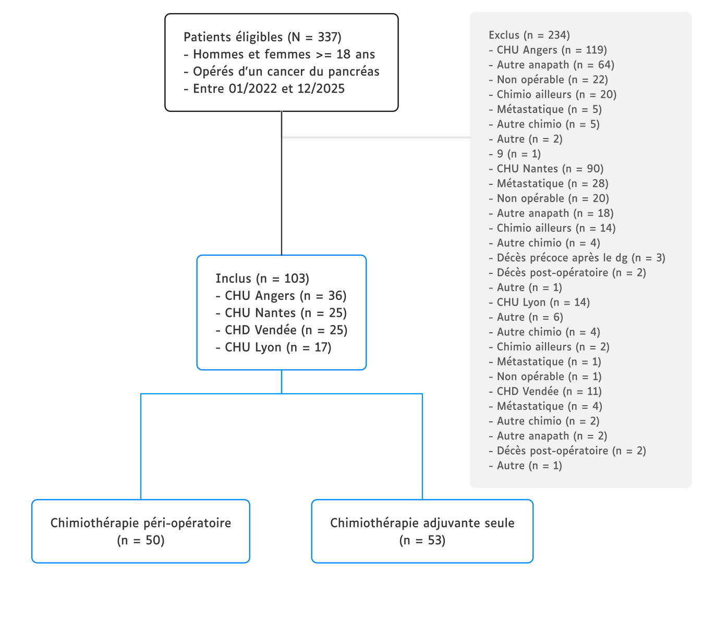

```{r}
#| label: setup
#| include: false

options(easy_out.quiet = TRUE)

conflicts_prefer(dplyr::filter, Gmisc::coords, .quiet = TRUE)

source("scripts/_setup.R")
auto_exec()
```





# Variables

::: panel-tabset
# Variables

Vue d'ensemble des variables utilisées

```{r}
#| label: df-vars

.check_df$vars
```

# Effectifs (init)

Effectifs bruts avant recodage

```{r}
#| label: df-distrib-init

.check_df$distrib_init
```

# Effectifs (recode)

Effectifs après recodage

```{r}
#| label: df-distrib-recode

.check_df$distrib_recode
```
:::

# Flowchart



```{r}
#| label: fig-flowchart
#| fig-cap: "Flowchart"
#| fig-cap-location: top


```

# Suivi



Recul de suivi estimé par la méthode de Kaplan-Meier inversée (censure et décès permutés)

```{r}
#| label: fig-follow
#| fig-cap: "Recul de suivi estimé par la méthode de Kaplan-Meier inversé"
#| fig-height: 3.75
#| fig-width: 7
#| out-width: 100%

fig_follow
```

# Analyse descriptive

## Caractéristiques des patients at baseline



```{r}
#| label: tbl-baseline
#| tbl-cap: "Caractéristiques des patients at baseline"

tbl_baseline
```

## Caractéristiques tumorales et prise en charge chirurgicale



```{r}
#| label: tbl-tumor
#| tbl-cap: "Caractéristiques tumorales et prise en charge chirurgicale"

tbl_tumor
```

## Caractéristiques du traitement

### Critère de jugement principal



```{r}
#| label: tbl-cjp
#| tbl-cap: "Critère de jugement principal : atteinte du nombre de cures cible selon le groupe"

tbl_outcome
```

### Doses reçues et adaptations

#### Phase d'induction



```{r}
#| label: tbl-ttt-induc
#| tbl-cap: "Doses reçues et adaptations à la phase d'induction"

tbl_ttt_induc
```

#### Phase adjuvante



```{r}
#| label: tbl-ttt-adj
#| tbl-cap: "Doses reçues et adaptations à la phase adjuvante"

tbl_ttt_adj
```

## Toxicité

Toxicités grade III-IV par phase de chimiothérapie

### Phase d'induction



```{r}
#| label: tbl-tox-induc
#| tbl-cap: "Toxicités grade III-IV à la phase d'induction"

tbl_tox_induc
```

### Phase adjuvante



```{r}
#| label: tbl-tox-adj
#| tbl-cap: "Toxicités grade III-IV à la phase adjuvante"

tbl_tox_adj
```

## Décès et récidive



```{r}
#| label: tbl-event
#| tbl-cap: "Décès et récidive"

tbl_event
```

# Analyse de survie

Stratification selon le protocole de chimio (adjuvant seul ou péri-opératoire)

## Survie globale







Délai depuis le diagnostic jusqu'au décès toutes causes

### Population totale

```{r}
#| label: fig-os-total
#| fig-cap: "Survie globale dans la population totale"
#| fig-height: 3.75
#| fig-width: 7
#| out-width: 100%

fig_surv_total$os
```

### Selon le protocole de chimiothérapie

```{r}
#| label: fig-os-strata
#| fig-cap: "Survie globale selon le protocole de chimio"
#| fig-height: 3.75
#| fig-width: 7
#| out-width: 100%

fig_surv_strata$os
```

```{r}
#| label: tbl-surv
#| tbl-cap: "Survie globale : estimations Kaplan-Meier en population totale et selon le protocole de chimio"

tbl_surv
```

## Survie sans récidive

Délai depuis la chirurgie jusqu'à la récidive ou le décès toutes causes

### Population totale

```{r}
#| label: fig-pfs-total
#| fig-cap: "Survie sans récidive dans la population totale"
#| fig-height: 3.75
#| fig-width: 7
#| out-width: 100%

fig_surv_total$pfs
```

### Selon le protocole de chimio

```{r}
#| label: fig-pfs-strata
#| fig-cap: "Survie sans récidive selon le protocole de chimio"
#| fig-height: 3.75
#| fig-width: 7
#| out-width: 100%

fig_surv_strata$pfs
```

## Incidence cumulée de récidive

Risques compétitifs (récidive vs décès sans récidive), depuis la chirurgie : **pas nécessaire (trop peu de décès)**

<!--




```{r}
#| label: tbl-cuminc
#| tbl-cap: "Incidence cumulée de récidive : estimations (risques compétitifs)"
#| eval: false

tbl_cuminc
```

### Population totale

```{r}
#| label: fig-cuminc-total
#| fig-cap: "Incidence cumulée de récidive dans la population totale"
#| fig-height: 3.75
#| fig-width: 7
#| out-width: 100%
#| eval: false

fig_cuminc_total
```

### Selon le nombre de cures

```{r}
#| label: fig-cuminc-strata
#| fig-cap: "Incidence cumulée de récidive selon le nombre total de cures (≥ 12 vs < 12)"
#| fig-height: 3.75
#| fig-width: 7
#| out-width: 100%
#| eval: false

fig_cuminc_strata
```
-->

# Analyse multivariable

## Régression logistique



Facteurs associés à la réception d'au moins 12 cures au total

```{r}
#| label: tbl-glm
#| tbl-cap: "Régression logistique : facteurs associés à la réception d'au moins 12 cures au total"

tbl_model_glm
```

## Estimation de la survie globale



Potentiel biais de temps immortel : tester modèle naïf + analyse de sensibilité landmark

```{r}
#| label: tbl-coxph
#| tbl-cap: "Modèle de Cox (naïf) : survie globale"

tbl_coxph
```

## Récidive

Modèle de fine gray : régression sur le sous-risque de récidive avec le décès sans récidive traité comme évènement compétitif : **pas pertinent (trop peu de décès)**

<!--


```{r}
#| label: tbl-crr
#| eval: false

tbl_model_crr
```
-->

# Annexe {.unnumbered}

<!--

--------------------------------------------------------------------------------

# Session {.unnumbered .unlisted}

```{r}
#| echo: true
#| eval: false

sessioninfo::session_info(pkgs = "attached")
```
-->
