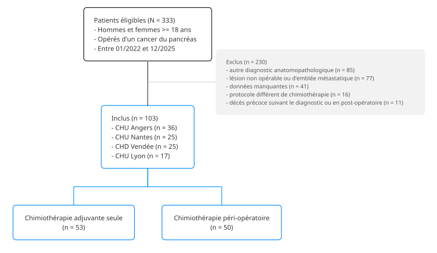

```{r}
#| label: setup
#| include: false

options(easy_out.quiet = TRUE)
conflicts_prefer(dplyr::filter, Gmisc::coords, .quiet = TRUE)

source("setup.R")
auto_exec()
```

::: callout-warning
# Rapport statistique en cours de rédaction
:::

<!-- # Structure du projet

 -->

# Résultats





## Variables

::: panel-tabset
# Variables

Vue d'ensemble des variables utilisées

```{r}
#| label: df-vars

.check_df$vars
```

# Effectifs (init)

Effectifs bruts avant recodage

```{r}
#| label: df-distrib-init

.check_df$distrib_init
```

# Effectifs (recode)

Effectifs après éventuel recodage

```{r}
#| label: df-distrib-recode

.check_df$distrib_recode
```
:::

## Flowchart



Dans un premier temps, `r n$eligible` patients ont été retenus pour éligibilité.
Parmi ces patients, `r n$exclus` ont été exclus.

Au total, ont été inclus `r n$inclus` patients adultes atteints d'un cancer du pancréas opéré entre janvier 2022 et décembre 2025, au CHU de Nantes ou dans un autre centre (4 centres au total).

```{r}
#| label: fig-flowchart
#| fig-cap: Flowchart
#| fig-cap-location: top


```

## Analyse descriptive

### Caractéristiques des patients at baseline



```{r}
#| label: tbl-baseline
#| tbl-cap: !expr title_suffix("Caractéristiques des patients at baseline")$overall

tbl_baseline
```

### Caractéristiques tumorales et prise en charge chirurgicale



```{r}
#| label: tbl-tumor
#| tbl-cap: !expr title_suffix("Caractéristiques tumorales et prise en charge chirurgicale")$overall

tbl_tumor
```

### Critère de jugement principal



Outcome : schéma incomplet (nombre total de cures reçues < 12)

```{r}
#| label: tbl-cjp
#| tbl-cap: !expr title_suffix("Nombre de cures reçues")$overall

tbl_outcome
```

### Caractéristiques du traitement

Doses reçues et adaptations de doses, par phase de chimiothérapie.

#### Phase d'induction



```{r}
#| label: tbl-ttt-induc
#| tbl-cap: !expr title_suffix("Doses reçues et adaptations de doses à la phase d'induction")$strata

tbl_ttt_induc
```

#### Phase adjuvante



```{r}
#| label: tbl-ttt-adj
#| tbl-cap: !expr title_suffix("Doses reçues et adaptations de doses à la phase adjuvante")$overall

tbl_ttt_adj
```

### Toxicité chimio-induite

Toxicité chimio-induite de grade III-IV, par phase de chimiothérapie.

#### Phase d'induction



Au total, sur l'ensemble des `r .tox_induc$n` patients ayant reçu une chimiothérapie d'induction, `r .tox_induc$n_ei` (`r .tox_induc$pct`) ont présenté au moins un effet indésirable de grade III-IV.

```{r}
#| label: tbl-tox-induc
#| tbl-cap: !expr title_suffix("Toxicité chimio-induite de grade III-IV à la phase d'induction")$strata

tbl_tox_induc
```

#### Phase adjuvante



Au total, sur l'ensemble des `r .tox_adj$n` patients ayant reçu une chimiothérapie adjuvante, `r .tox_adj$n_ei` (`r .tox_adj$pct`) ont présenté au moins un effet indésirable de grade III-IV.

```{r}
#| label: tbl-tox-adj
#| tbl-cap: !expr title_suffix("Toxicité chimio-induite de grade III-IV à la phase adjuvante")$overall

tbl_tox_adj
```

## Analyse de survie

Analyse comparative de la survie globale (OS) et de la survie sans récidive (PFS) selon le protocole de chimiothérapie.

### Suivi des patients



```{r}
#| label: fig-follow
#| fig-cap: !expr .title_fig_follow
#| fig-height: 3.75
#| fig-width: 7
#| out-width: 100%

.title_fig_follow <- str_fig(
  title = title_suffix("Recul de suivi")$strata,
  note = str_glue(
    "Recul de suivi estimé par la méthode de Kaplan-Meier inversée : l'évènement est la fin du suivi, la censure est le décès."
  )
)

fig_follow
```

Au moment de l'analyse, `r sum(df$os_event == 0)` patients étaient vivants.
Le suivi médian estimé par la méthode de Kaplan-Meier inversé était de `r .followup_median` mois.

### Évènements



```{r}
#| label: tbl-event
#| tbl-cap: Évènements.

tbl_event
```

### Survie globale







```{r}
#| label: fig-surv-title

.title_surv <- \(title) {
  str_fig(
    title = title,
    note = str_glue(
      "Les évènements et censures sont présentés en effectifs cumulés au cours du temps."
    )
  )
}
```

::: callout-note
### Survie globale : délai entre le diagnostic et le décès toutes causes
:::

```{r}
#| label: tbl-surv
#| tbl-cap: !expr title_suffix("Estimations Kaplan-Meier de la survie globale")$overall

tbl_surv
```

#### Population totale

```{r}
#| label: fig-surv-total-os
#| fig-cap: !expr .title_fig_surv_total_os
#| fig-height: 3.75
#| fig-width: 7
#| out-width: 100%

.title_fig_surv_total_os <- .title_surv(
  title = "Survie globale dans la population totale."
)

fig_surv_total$os
```

#### Selon le protocole de chimiothérapie

```{r}
#| label: fig-surv-strata-os
#| fig-cap: !expr .title_fig_surv_strata_os
#| fig-height: 3.75
#| fig-width: 7
#| out-width: 100%

.title_fig_surv_strata_os <- .title_surv(
  title = title_suffix("Survie globale")$strata
)

fig_surv_strata$os
```

### Survie sans récidive

::: callout-note
### Survie sans récidive : délai entre la chirurgie et la récidive ou le décès toutes causes
:::

#### Population totale

```{r}
#| label: fig-surv-total-pfs
#| fig-cap: !expr .title_fig_surv_total_pfs
#| fig-height: 3.75
#| fig-width: 7
#| out-width: 100%

.title_fig_surv_total_pfs <- .title_surv(
  title = "Survie sans récidive dans la population totale."
)

fig_surv_total$pfs
```

#### Par sous-groupes

```{r}
#| label: fig-surv-strata-pfs
#| fig-cap: !expr .title_fig_surv_strata_pfs
#| fig-height: 3.75
#| fig-width: 7
#| out-width: 100%

.title_fig_surv_strata_pfs <- .title_surv(
  title = title_suffix("Survie globale")$strata
)

fig_surv_strata$pfs
```

## Analyse multivariable

### Régression de quasi-Poisson



```{r}
#| label: tbl-pois-model
#| tbl-cap: "Facteurs associés à une augmentation du nombre total de cures reçues."

tbl_model_glm_pois
```

Nombre total de cures en moyenne 20% plus élevé dans le groupe péri-opératoire en comparaison au groupe adjuvant seul.
Persiste après ajustement dans l'analyse multivariée.

### Estimation de la survie globale



```{r}
#| label: tbl-coxph-model
#| tbl-cap: !expr title_suffix("Estimation de la survie globale")$strata

tbl_coxph
```

# Annexe {.unnumbered}

<!-- # Session {.unnumbered}

```{r}
#| label: session
#| echo: true

sessioninfo::session_info(pkgs = "attached")
``` -->
