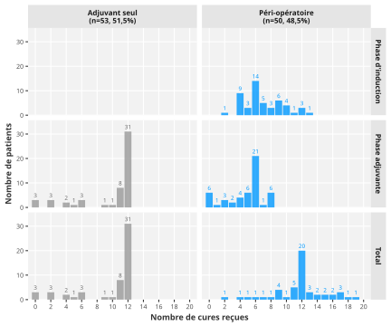

```{r}
#| label: setup
#| include: false

options(easy_out.quiet = TRUE)

source("setup.R")
auto_exec()
```

::: callout-warning
# Rapport statistique en cours de rédaction
:::

<!-- # Structure du projet

 -->

# Matériel et méthodes

## Design et aspects réglementaires

Il s'agit d'une étude observationnelle rétrospective multicentrique, conduite dans quatre centres hospitaliers ou hospitalo-universataires français : CHU Nantes, CHD La Roche-sur-Yon, CHU Angers et CHU Lyon.

Les données ont été recueillies rétrospectivement à partir du dossier patient informatisé.
L'étude a été menée conformément à la méthodologie de référence MR004 de la Commission nationale de l'informatique et des libertés (CNIL), qui encadre les recherches n'impliquant pas la personne humaine et les réutilisations de données de santé déjà recueillies.
L'absence d'opposition de chaque patient au traitement de ses données a été vérifiée.
S'agissant d'une recherche n'impliquant pas la personne humaine, l'avis d'un comité de protection des personnes n'était pas requis.

## Objectifs de l'étude

L'objectif principal était de comparer le nombre total de cures de chimiothérapie reçues entre les deux protocoles étudiés, chimiothérapie adjuvante seule et chimiothérapie péri-opératoire.

Les objectifs secondaires étaient de décrire les caractéristiques des patients, de leur tumeur et de leur prise en charge chirurgicale, de comparer la survie globale et la survie sans récidive entre les deux protocoles, de décrire la toxicité chimio-induite de grade III-IV, et de décrire les doses reçues et leurs adaptations pour chaque phase de chimiothérapie.

## Critères de jugement

### Critère de jugement principal

Le critère de jugement principal était le nombre total de cures de chimiothérapie reçues, toutes phases confondues (phase d'induction et phase adjuvante).
Un patient n'ayant reçu aucune cure d'une phase a été compté à zéro pour cette phase, et non en donnée manquante.

Ce critère a été analysé sous forme de comptage brut.
Le comptage du nombre de cures de chimiothérapie reçues par phase a été décrit.
La proportion de patients ayant reçu moins de 12 cures ou une dose relative moyenne inférieure à 80 % a été décrite à titre complémentaire.

### Critères de jugement secondaires

Les critères de jugement secondaires étaient la survie globale, la survie sans récidive, les doses reçues avec leurs adaptations ainsi que la toxicité chimio-induite de grade III-IV.

Les patients vivants ont été censurés à la date du recueil dans leur centre (date de point), la date de dernières nouvelles individuelle n'ayant pas été recueillie.
La censure était donc exclusivement administrative.

La survie globale était définie comme le délai entre la date de diagnostic et le décès toutes causes.
La survie sans récidive était définie comme le délai entre la date de la chirurgie et le premier évènement survenu parmi la récidive ou le décès toutes causes.
Le premier évènement observé pour chaque patient a été classé en récidive, décès sans récidive, ou censure.
Cette distribution des évènements a été décrite.

Les doses reçues et adaptations de doses ont été décrites séparément selon la phase de chimiothérapie.

La toxicité chimio-induite étudiée était la toxicité de grade III-IV cotée selon la classification Common Terminology Criteria for Adverse Events (CTCAE) v5.0, et décrite séparément selon la phase de chimiothérapie.

## Population d'étude

Critères d'inclusion : hommes et femmes âgés de 18 ans ou plus opérés d'un adénocarcinome pancréatique entre le 1er janvier 2022 et le 31 décembre 2025 dans l'un des quatre centres sus-cités.

Critères d'exclusion :

- Autre diagnostic anatomopathologique
- Lésion non opérable ou d'emblée métastatique
- Autre protocole de chimiothérapie
- Décès précoce post-diagnostic ou post-opératoire
- Données insuffisantes.

## Plan d'analyse statistique

### Analyses descriptives

Les variables catégorielles ont été présentées sous forme d'effectif et de pourcentage.
Les variables continues ont été présentées sous forme de médiane avec leur intervalle interquartile.
Le nombre de données manquantes a été précisé pour chaque variable concernée et pour chaque sous-groupe.

Les caractéristiques ont été décrites globalement et selon le protocole de chimiothérapie reçu.
Les groupes ont été comparés à l'aide des tests adaptés : test du Chi2 ou test exact de Fisher pour les variables qualitatives selon les conditions d'application, test de Wilcoxon-Mann-Whitney pour les variables quantitatives.
Ces comparaisons étaient descriptives.
Elles n'ont servi à sélectionner aucune variable des modèles multivariables.
Les variables ont été incluses a priori sur des considérations cliniques.

Les tests statistiques étaient bilatéraux.
Le degré de significativité statistique était défini par une p-valeur inférieure ou égale au seuil de 5%.

### Analyse du critère de jugement principal

Le nombre total de cures reçues a été analysé sous sa forme de comptage, sans dichotomisation.
Le nombre total de cures a d'abord été modélisé par une régression de Poisson.
L'hypothèse d'équidispersion que cette loi suppose a été vérifiée sur ce modèle par un test de dispersion de Pearson.
Une surdispersion ayant été mise en évidence, la famille quasi-Poisson a été retenue pour l'ensemble des estimations rapportées.
Ce choix a été fait au vu des données et non a priori.
Il laisse les estimations ponctuelles inchangées et n'agit que sur leur précision, corrigée du facteur de dispersion.

Chaque variable a été étudiée séparément de façon univariée, puis les variables retenus a priori ont été incluses dans un modèle ajusté (multivariable).
Les coefficients ont été exponentiés et présentés sous forme de rapports du nombre moyen de cures, accompagnés de leur intervalle de confiance à 95 %.
Le degré de significatvité statistique a été calculé globalement pour chaque variable catégorielle comportant plus de deux modalités.

L'absence de colinéarité entre les variables du modèle ajusté a été vérifiée par le facteur d'inflation de la variance.
La présence d'observations influentes a été vérifiée par la détection des distances de Cook au seuil de `r .pois_check_cook$threshold`.

### Analyses de survie

Le suivi médian a été estimé par la méthode de Kaplan-Meier inversée (méthode de Schemper), l'évènement étant la fin du suivi et la censure étant le décès.
La courbe de suivi a été représenté graphiquement depuis la date de diagnostic, selon le protocole de chimiothérapie.

Les courbes de survie globale et de survie sans récidive ont été estimées par la méthode de Kaplan-Meier, d'abord dans la population totale puis selon le protocole de chimiothérapie.
Les probabilités de survie ont été rapportées à plusieurs intervalles de temps, avec leur intervalle de confiance à 95 %.
Les médianes de survie ont été rapportées avec leur intervalle de confiance à 95 %, ou déclarées non atteintes le cas échéant.
Les effectifs à risque ont été rapportés sous chaque courbe, ainsi que les évènements et les censures rapportés en effectifs cumulés au cours du temps.

Les courbes ont été comparées par le test du log-rank.
L'effet du protocole de chimiothérapie a été estimé par un modèle de Cox univariable.

### Analyse multivariable de la survie globale

L'effet de chaque facteur pronostique sur le risque de décès a été estimé par des modèles de Cox univariables.
Les facteurs étudiés étaient le protocole de chimiothérapie, le centre, l'âge au diagnostic et le Performance Status au diagnostic.
Les hazard ratios et leurs intervalles de confiance à 95 % représentent, pour chacun de ces facteurs, le sur-risque ou le sous-risque de décès par rapport à la modalité de référence.

Les variables incluses dans le modèle multivariable ont été définies a priori sur des considérations cliniques.
Aucune sélection de variables fondée sur la significativité statistique en analyse univariable n'a été réalisée.
Le nombre d'évènements et le nombre d'observations complètes du modèle multivariable ont été rapportés, ainsi que le nombre d'observations écartées pour données manquantes.

L'hypothèse de proportionnalité des risques a été vérifiée pour chaque variable et ainsi que globalement par le test basé sur les résidus de Schoenfeld.

### Données manquantes

Le nombre de données manquantes a été précisé pour chaque variable décrite et pour chaque sous-groupe.
Aucune imputation n'a été réalisée pour cette étude.
Les modèles multivariables ont été estimés sur les observations complètes pour l'ensemble des variables incluses.
Le nombre d'observations écartées pour données manquantes a été rapporté sous chaque tableau.

### Taille d'échantillon et puissance

Aucun calcul du nombre de sujets nécessaires n'a été réalisé pour cette étude.
L'effectif analysé était déterminé par le nombre de dossiers disponibles dans les quatre centres au moment du recueil, sur la période étudiée.
La puissance statistique n'a pas été planifiée.

### Logiciel

Les analyses ont été réalisées avec `r R.version.string`.

# Résultats





## Variables

::: panel-tabset
# Variables

Vue d'ensemble des variables utilisées

```{r}
#| label: df-vars

.check_df$vars
```

# Effectifs (init)

Effectifs bruts avant recodage

```{r}
#| label: df-distrib-init

.check_df$distrib_init
```

# Effectifs (recode)

Effectifs après éventuel recodage

```{r}
#| label: df-distrib-recode

.check_df$distrib_recode
```
:::

## Flowchart



Dans un premier temps, `r n$eligible` patients ont été retenus pour éligibilité.
Parmi ces patients, `r n$exclus` ont été exclus.

Au total, ont été inclus `r n$inclus` patients adultes atteints d'un cancer du pancréas opéré entre janvier 2022 et décembre 2025, au CHU de Nantes ou dans un autre centre (4 centres au total).

```{r}
#| label: fig-flowchart
#| fig-cap: Flowchart
#| fig-cap-location: top

knitr::include_graphics("output/fig_flowchart.svg")
```

## Analyse descriptive

### Caractéristiques des patients at baseline



```{r}
#| label: tbl-baseline
#| tbl-cap: !expr title_suffix("Caractéristiques des patients at baseline")$overall

tbl_baseline
```

### Caractéristiques tumorales et prise en charge chirurgicale



```{r}
#| label: tbl-tumor
#| tbl-cap: !expr title_suffix("Caractéristiques tumorales et prise en charge chirurgicale")$overall

tbl_tumor
```

### Critère de jugement principal



Nombre de cures reçues, par phase de chimiothérapie et au total, globalement et selon le protocole de chimiothérapie.

```{r}
#| label: tbl-cjp
#| tbl-cap: !expr title_suffix("Nombre de cures reçues")$overall

tbl_outcome
```



```{r}
#| label: fig-cjp
#| fig-cap: Distribution du nombre de cures reçues, par phase et selon le protocole de chimiothérapie.
#| out-width: 90%


```

### Caractéristiques du traitement

Doses reçues et adaptations de doses, par phase de chimiothérapie.

#### Phase d'induction



```{r}
#| label: tbl-ttt-induc
#| tbl-cap: !expr title_suffix("Doses reçues et adaptations de doses à la phase d'induction")$strata

tbl_ttt_induc
```

#### Phase adjuvante



```{r}
#| label: tbl-ttt-adj
#| tbl-cap: !expr title_suffix("Doses reçues et adaptations de doses à la phase adjuvante")$overall

tbl_ttt_adj
```

### Toxicité chimio-induite

Toxicité chimio-induite de grade III-IV, par phase de chimiothérapie.

#### Phase d'induction



Au total, sur l'ensemble des `r .tox_induc$n` patients ayant reçu une chimiothérapie d'induction, `r .tox_induc$n_ei` (`r .tox_induc$pct`) ont présenté au moins un effet indésirable de grade III-IV.

```{r}
#| label: tbl-tox-induc
#| tbl-cap: !expr title_suffix("Toxicité chimio-induite de grade III-IV à la phase d'induction")$strata

tbl_tox_induc
```

#### Phase adjuvante



Au total, sur l'ensemble des `r .tox_adj$n` patients ayant reçu une chimiothérapie adjuvante, `r .tox_adj$n_ei` (`r .tox_adj$pct`) ont présenté au moins un effet indésirable de grade III-IV.

```{r}
#| label: tbl-tox-adj
#| tbl-cap: !expr title_suffix("Toxicité chimio-induite de grade III-IV à la phase adjuvante")$overall

tbl_tox_adj
```

## Analyse du critère de jugement principal



Le facteur de dispersion estimé était de `r round(.model$glm$pois$check$overdispersion$dispersion_ratio, 2)` (test de dispersion de Pearson : `r style_pvalue(.model$glm$pois$check$overdispersion$p_value, digits = 2, prepend_p = TRUE)`).
La dispersion observée justifiait le recours à la famille quasi-Poisson.

```{r}
#| label: tbl-pois-model
#| tbl-cap: "Facteurs associés à une augmentation du nombre total de cures reçues."

tbl_model_glm_pois
```

Nombre total de cures en moyenne 20% plus élevé dans le groupe péri-opératoire en comparaison au groupe adjuvant seul.
Persiste après ajustement dans l'analyse multivariée.

## Analyse de survie

Analyse comparative de la survie globale (OS) et de la survie sans récidive (PFS) selon le protocole de chimiothérapie.

### Suivi des patients



```{r}
#| label: fig-follow
#| fig-cap: !expr .title_fig_follow
#| fig-height: 3.75
#| fig-width: 7
#| out-width: 100%

.title_fig_follow <- str_fig(
  title = title_suffix("Recul de suivi")$strata,
  note = str_glue(
    "Recul de suivi estimé par la méthode de Kaplan-Meier inversée : l'évènement est la fin du suivi, la censure est le décès."
  )
)

fig_follow
```

Les dates de point, fixées pour chaque centre à la date du recueil, étaient les suivantes :

```{r}
#| label: date-point
#| output: asis

df |>
  distinct(centre, date_lastnews) |>
  arrange(centre) |>
  mutate(
    txt = str_glue("- {centre} : {format(date_lastnews, '%d/%m/%Y')}")
  ) |>
  pull(txt) |>
  str_flatten("\n") |>
  cat()
```

Au moment de l'analyse, `r .followup_alive$n` patients étaient vivants, avec un recul de `r .followup_alive$min` à `r .followup_alive$max` mois.
Le suivi médian estimé par la méthode de Kaplan-Meier inversé était de `r .followup_median` mois.
Les durées de suivi étaient comparables entre les deux groupes.

### Évènements



```{r}
#| label: tbl-event
#| tbl-cap: Évènements.

tbl_event
```

### Survie globale







```{r}
#| label: fig-surv-title

.title_surv <- \(title) {
  str_fig(
    title = title,
    note = str_glue(
      "Les évènements et censures sont présentés en effectifs cumulés au cours du temps."
    )
  )
}
```

```{r}
#| label: tbl-surv
#| tbl-cap: !expr title_suffix("Estimations Kaplan-Meier de la survie globale")$overall

tbl_surv
```

#### Population totale

```{r}
#| label: fig-surv-total-os
#| fig-cap: !expr .title_fig_surv_total_os
#| fig-height: 3.75
#| fig-width: 7
#| out-width: 100%

.title_fig_surv_total_os <- .title_surv(
  title = "Survie globale dans la population totale."
)

fig_surv_total$os
```

#### Selon le protocole de chimiothérapie

```{r}
#| label: fig-surv-strata-os
#| fig-cap: !expr .title_fig_surv_strata_os
#| fig-height: 3.75
#| fig-width: 7
#| out-width: 100%

.title_fig_surv_strata_os <- .title_surv(
  title = title_suffix("Survie globale")$strata
)

fig_surv_strata$os
```

### Survie sans récidive

#### Population totale

```{r}
#| label: fig-surv-total-pfs
#| fig-cap: !expr .title_fig_surv_total_pfs
#| fig-height: 3.75
#| fig-width: 7
#| out-width: 100%

.title_fig_surv_total_pfs <- .title_surv(
  title = "Survie sans récidive dans la population totale."
)

fig_surv_total$pfs
```

#### Par sous-groupes

```{r}
#| label: fig-surv-strata-pfs
#| fig-cap: !expr .title_fig_surv_strata_pfs
#| fig-height: 3.75
#| fig-width: 7
#| out-width: 100%

.title_fig_surv_strata_pfs <- .title_surv(
  title = title_suffix("Survie sans récidive")$strata
)

fig_surv_strata$pfs
```

### Analyse multivariable de la survie globale



```{r}
#| label: tbl-coxph-model
#| tbl-cap: !expr title_suffix("Estimation de la survie globale")$strata

tbl_coxph
```

L'hypothèse des risques proportionnels n'était mise en défaut ni pour l'ensemble du modèle (`r style_pvalue(.model$coxph$check$table["GLOBAL", "p"], digits = 2, prepend_p = TRUE)`), ni pour aucune des variables prises séparément (@anx-coxzph).

# Annexes

## Vérification des hypothèses

### Modèle de quasi-Poisson

VIF : mesure de combien la variance du coefficient est augmentée par la corrélation de la variable avec les autres variables du modèle.

::: {#anx-pois-vif}
```{r}
gt_qmd(.pois_check_vif)
```

Facteurs d'inflation de la variance
:::

1 = absence de corrélation\
< 5 = pas de collinéarité

vif_adj : VIF corrigé du nombre de degrés de liberté de la variable, ce qui le rend comparable d'une variable à l'autre et lui donne l'interprétation directe d'un facteur multiplicatif appliqué à l'erreur standard.

tolérance : inverse du facteur d'inflation

Influence des observations détectée par la distance de Cook, qui mesure le déplacement de l'ensemble des coefficients du modèle lorsqu'une observation est retirée.
La valeur maximale observée était de `r .pois_check_cook$max` pour un seuil de `r .pois_check_cook$threshold` : aucune observation considérée comme influente.

### Modèle de Cox

La @anx-coxzph rapporte, pour chaque variable du modèle multivariable et pour l'ensemble du modèle, le test de proportionnalité des risques basé sur les résidus de Schoenfeld.

::: {#anx-coxzph}
```{r}
gt_qmd(.coxph_check_tbl)
```

Test des risques proportionnels (résidus de Schoenfeld)
:::

Un degré de significativité faible < 0,05 signalerait un effet variable au cours du temps (risque non-proportionnel).
Hypothèse de proportionnalité valide ici.

<!-- # Session {.unnumbered}

```{r}
#| label: session
#| echo: true

sessioninfo::session_info(pkgs = "attached")
``` -->
